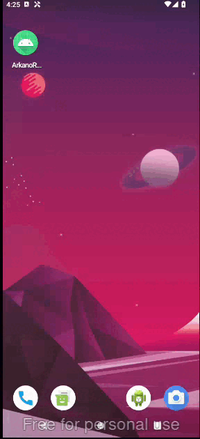

# Rick & Morty Challenge
Aplicación Android desarrollada como resolución al "Technical Challenge - Android Developer". Consume la API pública de [Rick and Morty](https://rickandmortyapi.com/) para mostrar una lista de personajes. 

El proyecto está construido siguiendo los principios de **Clean Architecture**, el patrón de diseño **MVVM** (Model-View-ViewModel) y las directrices modernas de desarrollo de Android utilizando **Jetpack Compose**.
## DEMO APP

## 📱 Características de la App
- [x] Listado de personajes de Rick and Morty.
- [x] Detalle en cada ítem: Imagen, Nombre, Especie y Estado (Vivo, Muerto, Desconocido) con indicador visual.
- [x] Manejo de estados de la UI explícito (Loading, Success, Error con botón de reintento).
- [x] Carga eficiente de imágenes y manejo de errores.
- [x] Funcionalidad "Pull-to-refresh" para recargar la lista con una página aleatoria.

## 🏗️ Arquitectura
El proyecto utiliza una arquitectura basada en **Clean Architecture** y **MVVM** para asegurar la separación de responsabilidades, testabilidad y escalabilidad. Se divide en tres capas principales:

* **Presentation Layer:** Contiene la UI construida con Jetpack Compose y los `ViewModels`. Maneja el estado de la vista utilizando `StateFlow`.
* **Domain Layer:** Contiene los modelos de negocio y los `UseCases`. Es un módulo de Kotlin puro que no tiene dependencias de Android.
* **Data Layer:** Implementa las interfaces de los repositorios definidos en la capa de dominio. Maneja la comunicación con la API usando Retrofit y mapea los DTOs a modelos de dominio.

## 🛠️ Tech Stack & Librerías
- **Lenguaje:** [Kotlin](https://kotlinlang.org/)
- **UI:** [Jetpack Compose](https://developer.android.com/jetpack/compose) (Material 3)
- **Arquitectura:** MVVM + Clean Architecture
- **Inyección de Dependencias:** [Dagger Hilt](https://developer.android.com/training/dependency-injection/hilt-android)
- **Concurrencia:** [Coroutines](https://kotlinlang.org/docs/coroutines-overview.html) & [Flow / StateFlow](https://developer.android.com/kotlin/flow)
- **Networking:** [Retrofit](https://square.github.io/retrofit/)
- **Serialización:** Gson
- **Carga de Imágenes:** [Coil](https://coil-kt.github.io/coil/compose/) (Optimizado para Compose)
- **Testing:** JUnit4, MockK, Coroutines Test

---

### Decisiones técnicas tomadas
1. **Jetpack Compose sobre XML:** Se optó por Compose para el renderizado de la UI debido a su naturaleza declarativa, lo que permite manejar los estados (*Loading, Success, Error*) de forma mucho más limpia y con menos código *boilerplate* que en XML.
2. **Coil para imágenes:** Se eligió Coil en lugar de Glide/Picasso porque está construido completamente en Kotlin usando Corrutinas y se integra de manera nativa y óptima con Jetpack Compose (`SubcomposeAsyncImage`), facilitando el manejo de *placeholders* y estados de error.
3. **Manejo de Estado con StateFlow:** Se utilizó `StateFlow` en el ViewModel encapsulando un *Sealed Class* (`CharacterListState`) para garantizar un flujo unidireccional de datos (UDF).
4. **Pull-to-Refresh Moderno:** En lugar de recargar la misma página, se implementó el componente `PullToRefreshBox` de Material 3 para traer una página aleatoria (del 1 al 30) de la API, demostrando un manejo dinámico de las llamadas de red.

### Qué quedó fuera por falta de tiempo

* **Paginación Real (Infinite Scrolling):** Actualmente trae una página específica. La integración de la librería `Paging 3` quedó pendiente.
* **Caché Local (Offline First):** No se implementó una base de datos local (Room) para persistir los datos si no hay conexión a internet.
* **Navegación:** Una pantalla de detalle del personaje utilizando `Navigation Compose`, se podria crear un nuevo Screen para el Detalle de cada personaje.

### Qué mejoraríamos?

* Implementar **Paging 3** para cargar la lista de personajes de manera continua al hacer scroll hacia abajo.
* Añadir un sistema de **Caché con Room** utilizando el patrón *Single Source of Truth* (MediatorLiveData/Flow).
* Crear pruebas de UI (UI Tests) utilizando Compose Test Rule, ya que actualmente solo se implementaron Pruebas Unitarias (Unit Tests) para el ViewModel y los UseCases.

### Uso de IA
Se utilizó IA como asistente técnico durante el desarrollo (Pair Programming) específicamente para:

* **Testing:** Acelerar la escritura del *boilerplate* y la configuración (setup) de las pruebas unitarias para el `ViewModel` y los `UseCases` utilizando la librería `MockK` y `kotlinx-coroutines-test`.
* **README.md:** Mejorar el formato del Readme.md

---

## 🚀 Cómo ejecutar el proyecto
1. Clona el repositorio: `git clone https://github.com/AlexFernandoOsorio/Rick-Morty-Challenge`
2. Abre el proyecto en **Android Studio** (Koala o superior recomendado).
3. Sincroniza el proyecto con Gradle.
4. Ejecuta la aplicación en un emulador o dispositivo físico (API 24+).
